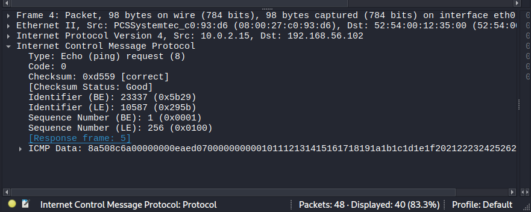
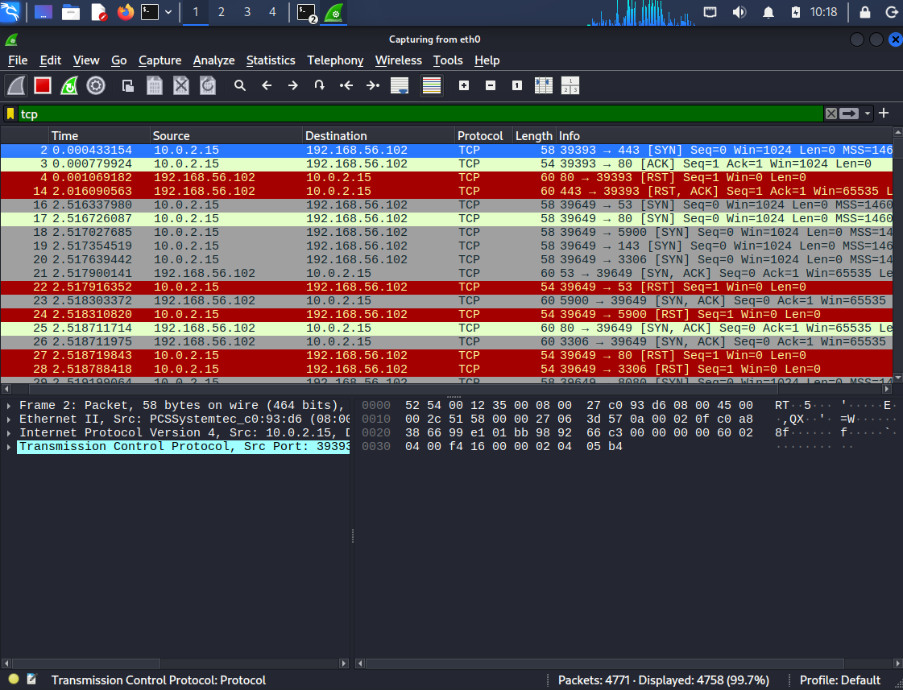
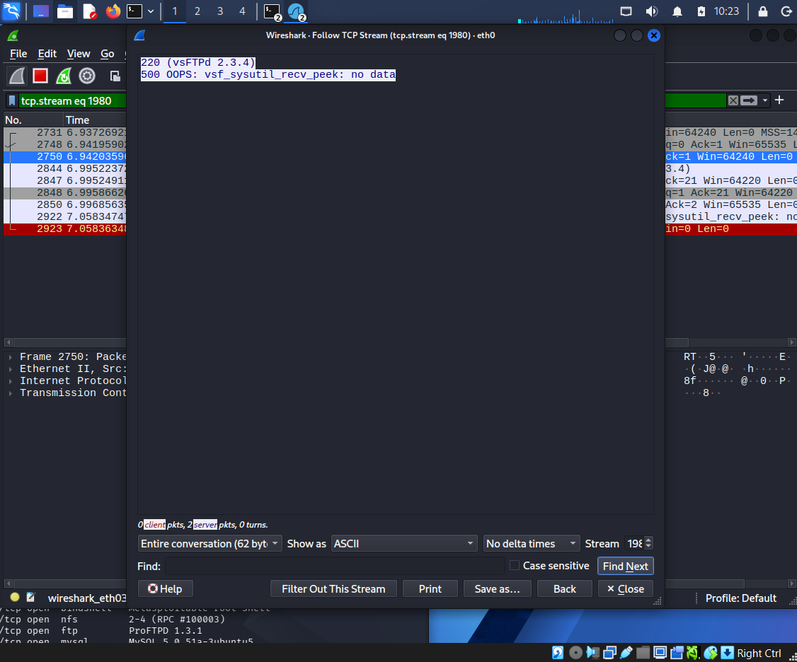
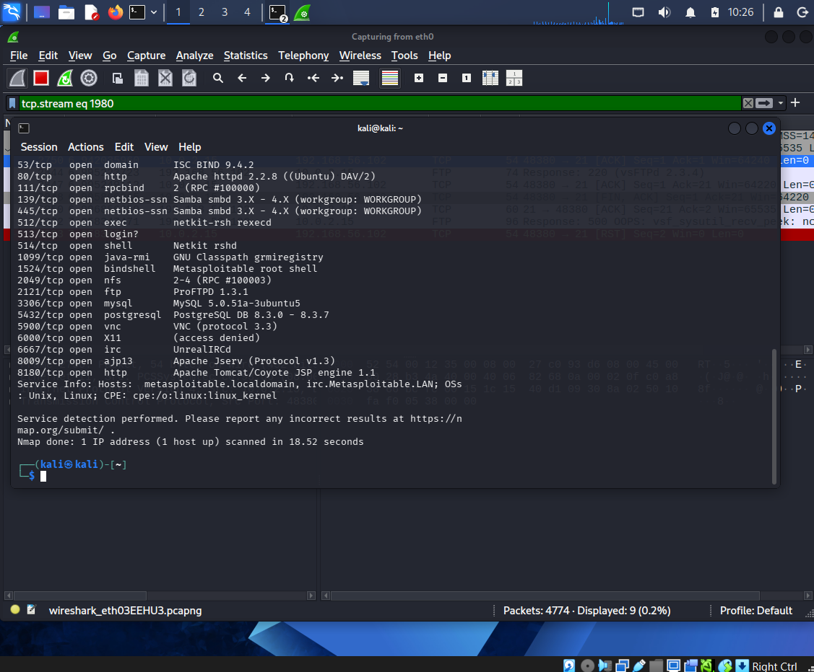
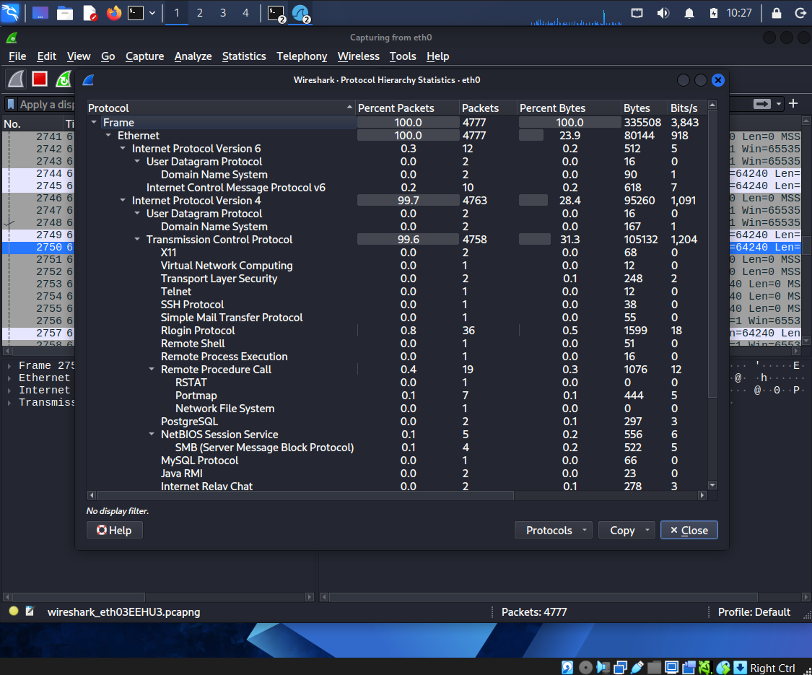
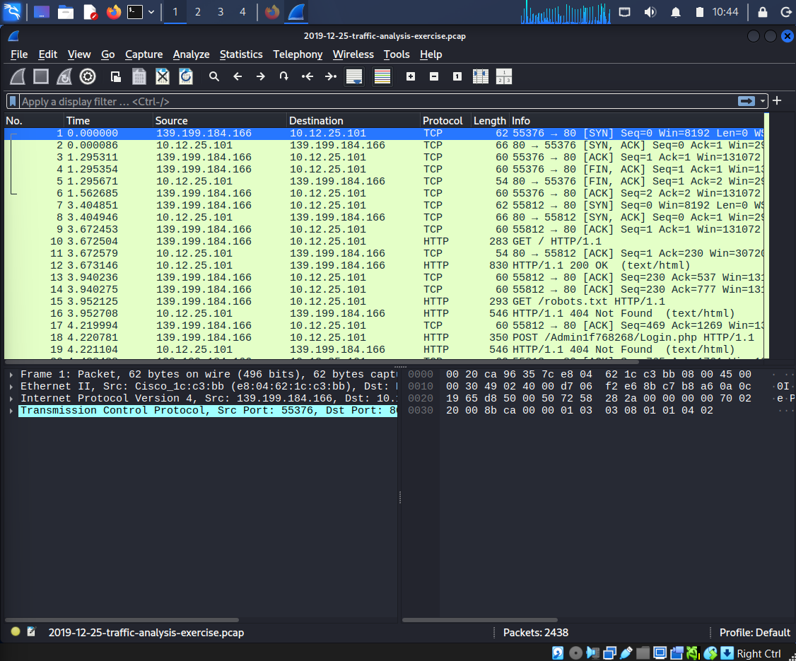
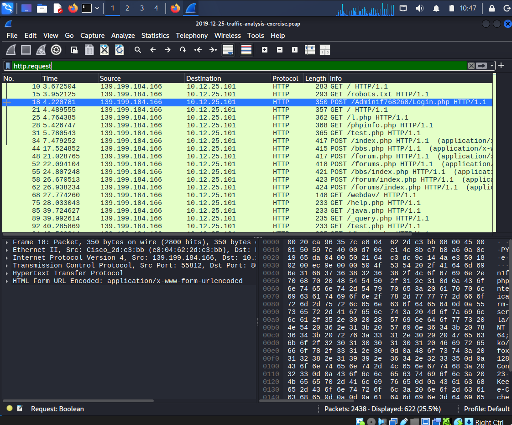
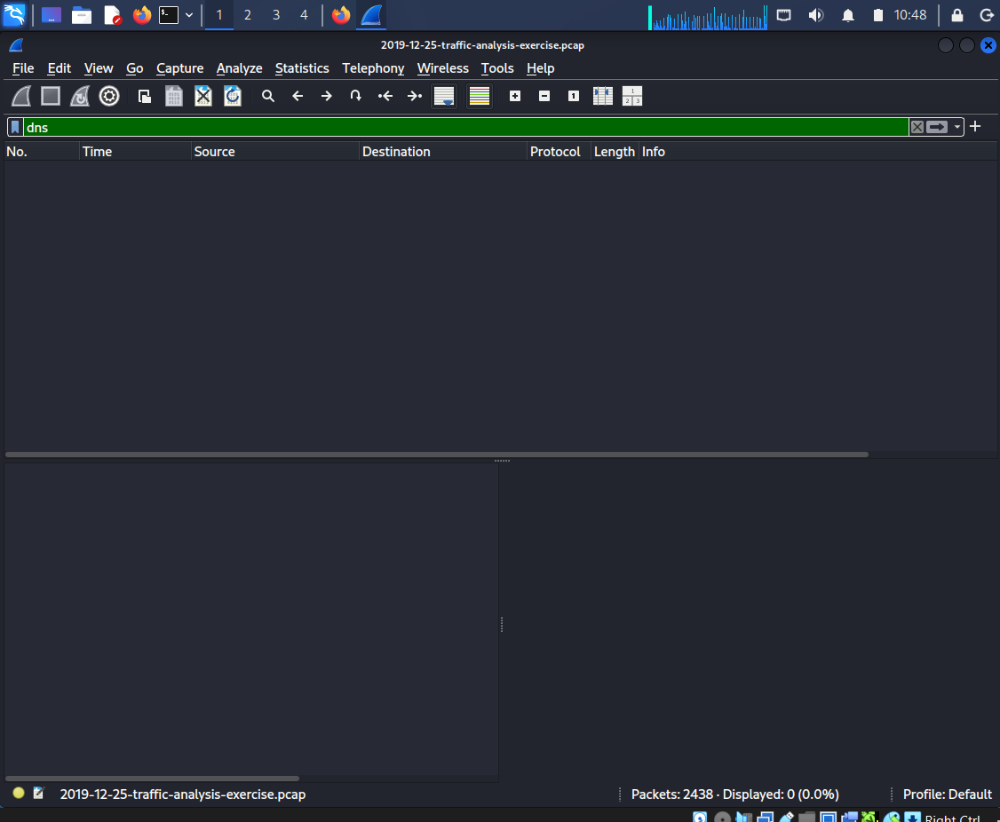
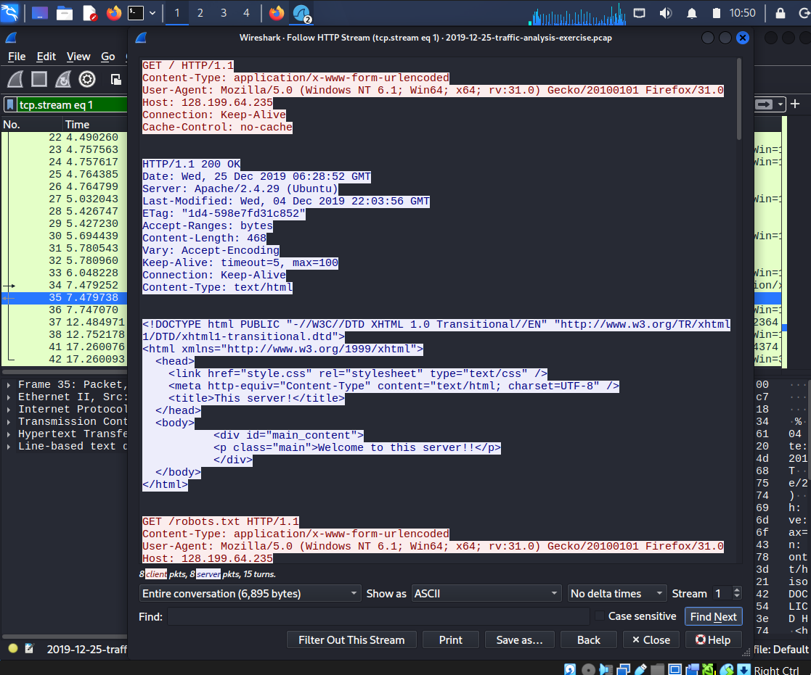
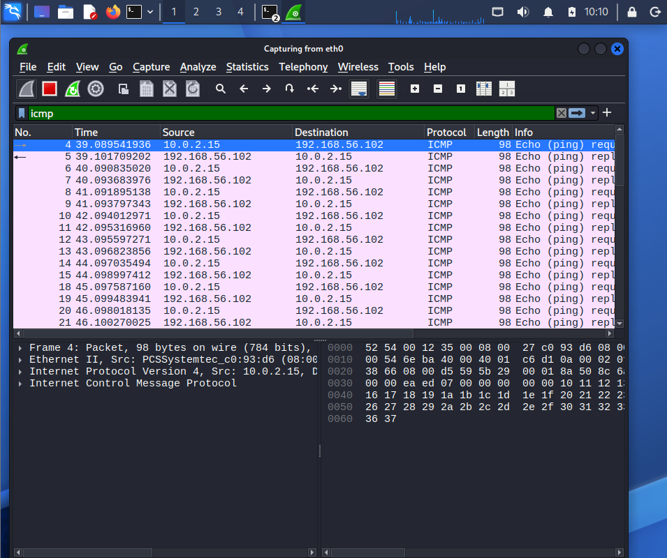

# 📡 Network Packet Analysis — Cybersecurity Portfolio Project

## Overview
Performed network traffic analysis using Wireshark on an isolated 
home lab environment. Captured and analysed ICMP, TCP, and HTTP 
traffic between Kali Linux and Metasploitable2, then investigated 
a real malicious PCAP file from a 2019 web application attack.

## Tools Used
- Wireshark 4.6.4
- Kali Linux
- Metasploitable2 (target: 192.168.56.102)
- Nmap (for generating TCP traffic)
- Malware Traffic Analysis exercise PCAP (2019-12-25)

## Part 1 — Lab Traffic Capture

### ICMP Traffic — Ping Request/Reply
Captured ping traffic between Kali (10.0.2.15) and 
Metasploitable2 (192.168.56.102) using the `icmp` filter.
Identified alternating Echo Request and Echo Reply packets 
with full Ethernet, IP, and ICMP layer breakdown.

### TCP 3-Way Handshake
Generated TCP traffic using `nmap -sV 192.168.56.102` 
and filtered with `tcp`. Identified SYN → SYN-ACK → ACK 
sequence confirming connection establishment. Nmap's 
half-open SYN scan visible — RST sent after SYN-ACK 
received, avoiding full connection.

### TCP Stream — Port 21 (FTP)
Followed TCP stream on port 21 revealing Metasploitable2's 
FTP service banner (ProFTPD 1.3.1) — an outdated version 
with known vulnerabilities.

### Nmap Service Discovery Results
Service scan revealed multiple open ports on Metasploitable2 
including FTP, NFS, MySQL, and a root shell — all representing 
critical attack surfaces.

### Protocol Hierarchy
Statistics → Protocol Hierarchy showing full breakdown of 
all protocols captured during lab session.

---

## Part 2 — Malicious PCAP Analysis

**Source:** malware-traffic-analysis.net training exercise  
**File:** 2019-12-25-traffic-analysis-exercise.pcap  
**Total packets:** 2,438

### Overview — Raw Traffic
Initial view showing communication between external IP 
139.199.184.166 and internal victim 10.12.25.101.

### HTTP Request Analysis
Filtered with `http.request` — revealed systematic 
web application attack with 622 matching packets (25.5% 
of total traffic).

### DNS Analysis
No DNS traffic found in this PCAP. The attacker connected 
directly by IP address without performing DNS lookups — 
indicating prior reconnaissance of the target and a 
pre-planned targeted attack rather than opportunistic scanning.

### HTTP Stream — Full Attack Conversation
Followed HTTP stream revealing complete attacker-server 
conversation including browser spoofing via User-Agent header.

### Wireshark Overview
Full packet list showing TCP handshakes and HTTP traffic flow.

---

## Attack Analysis

### Identified IOCs
| Indicator | Value |
|---|---|
| Attacker IP | 139.199.184.166 |
| Victim IP | 10.12.25.101 |
| Attack date | 25 December 2019, 06:28 UTC |
| Protocol | HTTP over TCP port 80 |
| DNS traffic | None — direct IP connection |

### Attack Timeline
1. **Reconnaissance** — GET / and GET /robots.txt to map server
2. **Admin probe** — POST /Admin1f768268/Login.php 
   attempting hidden backdoor access
3. **PHP probing** — GET /l.php, /phpinfo.php, /test.php, 
   /java.php scanning for exposed files
4. **WebDAV check** — GET /webdav/ testing for 
   file upload vulnerability
5. **Forum exploitation** — POST to /bbs.php, /forum.php, 
   /forums.php attempting CMS vulnerabilities

### Server Information Exposed
- Apache 2.4.29 running on Ubuntu
- Attacker spoofed Firefox 31.0 User-Agent to evade detection
- Server responded "Welcome to this server!!" — accessible

### Key Finding
No DNS queries present in capture — attacker used direct IP 
addressing, strongly suggesting pre-planned targeted attack 
with prior knowledge of the victim's infrastructure.

### SOC Response — What I Would Do
1. Immediately block 139.199.184.166 at the perimeter firewall
2. Check if any POST requests returned HTTP 200 OK 
   (indicating successful file upload or login)
3. Search SIEM for this IP across all other internal machine logs
4. Check web server access logs for full request history
5. Alert incident response team with this PCAP as evidence
6. Scan victim machine for any webshells or backdoors uploaded

---

## Key Concepts Demonstrated
- Network traffic capture and filtering
- TCP/IP protocol analysis (ICMP, TCP, HTTP)
- TCP 3-way handshake identification
- Malicious traffic pattern recognition
- Indicator of Compromise (IOC) identification
- Web application attack analysis
- SOC analyst investigation methodology

## Skills Demonstrated
`Wireshark` `Packet Analysis` `PCAP Investigation` `TCP/IP` 
`Nmap` `IOC Identification` `HTTP Analysis` `Incident Response` 
`Network Forensics` `Threat Detection`
